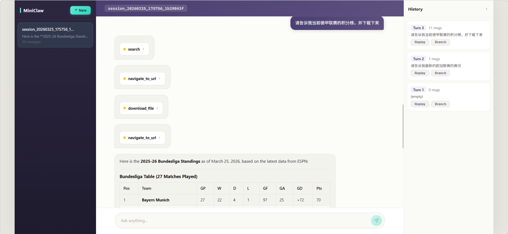
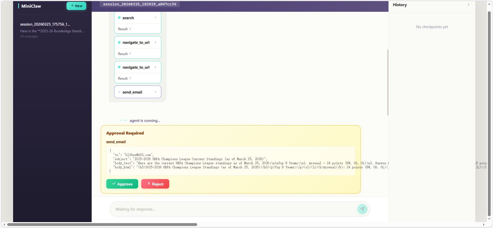

# MiniClaw

[English](README.md) | [中文](README_zh.md)

MiniClaw is a modular LangGraph-based agent with a full-stack Chat UI. It features async workflow orchestration, tool calling with human approval gates, lightweight RAG, subagent fan-out/fan-in, persistent checkpointing, and time-travel debugging.

## Screenshots

| Tool Execution & Markdown Rendering | Human-in-the-Loop Approval |
|---|---|
|  |  |

## Features

**Agent Core**
- LangGraph async workflow with classifier routing (RAG / Subagent / Direct)
- Parallel tool execution for multi-tool model responses
- RAG over local documents and conversation history via Chroma
- Subagent fan-out/fan-in for multi-item parallel analysis
- Experience reflection and automatic history summarization

**Full-Stack Chat UI**
- FastAPI backend with SSE streaming for real-time token output
- React + TypeScript frontend with Zustand state management
- Markdown rendering with GFM tables, syntax-highlighted code blocks, and copy button
- Tool call cards with live status indicators (pending / executing / completed / error)
- Human-in-the-loop approval banner for sensitive tools (send_email, download_file, run_python_code)

**Session Management**
- Multi-session support with persistent SQLite checkpointing
- Time Travel: replay from any checkpoint in the history panel
- Branching: fork a conversation from any past state
- History panel filtered by user interaction turns (not internal node steps)

## Architecture

```text
Client (React + Vite)              Server (FastAPI)
+-----------------+   POST /chat   +------------------+
|  SessionSidebar |--------------->|  SSE Stream      |---> graph.astream()
|  ChatPanel      |<-- SSE events -|  Handler         |
|  HistoryPanel   |                |                  |
|  ApprovalBanner |-- POST /approve|  ApprovalManager |---> asyncio.Event
+-----------------+                +------------------+
```

## Project Structure

```text
.
+-- agent_core.py           # Graph assembly and routing
+-- api.py                  # FastAPI application and routes
+-- api_models.py           # Pydantic request/response models
+-- approval_manager.py     # Async approval state machine
+-- stream_handler.py       # SSE streaming wrapper for astream
+-- checkpointer.py         # AsyncSqliteSaver initialization
+-- session_manager.py      # Session CRUD and time-travel helpers
+-- runner.py               # CLI streaming runner with approval flow
+-- main.py                 # CLI entry point with slash commands
+-- config.py               # LLM configuration from environment
+-- state.py                # AgentState TypedDict definition
+-- utils.py                # Sensitive tool detection, reflection
+-- nodes/                  # Graph node implementations
+-- tools/                  # Tool definitions
+-- rag/                    # Chroma-backed retrieval helpers
+-- skills/                 # Skill prompts and SOPs
+-- Dockerfile              # Backend container image
+-- docker-compose.yml      # Full-stack orchestration
+-- web/                    # React frontend
    +-- Dockerfile          # Frontend multi-stage build
    +-- nginx.conf          # Nginx reverse proxy config
    +-- src/
        +-- api/            # REST + SSE fetch client
        +-- stores/         # Zustand global state
        +-- hooks/          # useChat, useSessions
        +-- components/     # Chat, Sidebar, History panels
        +-- types/          # TypeScript type definitions
```

## Getting Started

### Prerequisites

- Python 3.9+
- Node.js 18+
- An OpenAI-compatible API endpoint

### Installation

```bash
git clone https://github.com/bl16e/MiniClaw.git
cd MiniClaw

# Python dependencies
pip install -r requirements.txt

# Frontend dependencies
cd web && npm install && cd ..
```

### Configuration

```bash
cp .env.example .env
# Edit .env and fill in your API key
```

| Variable | Required | Description |
|----------|----------|-------------|
| `OPENAI_API_KEY` | Yes | API key for OpenAI-compatible endpoint |
| `OPENAI_API_BASE` | No | API base URL (default: DashScope) |
| `MODEL_NAME` | No | Model name (default: qwen-max) |
| `HTTP_PROXY` / `HTTPS_PROXY` | No | Network proxy |
| `GMAIL_CREDENTIALS_FILE` | No | Gmail OAuth credentials path |
| `CORS_ORIGINS` | No | Allowed CORS origins, comma-separated (default: `http://localhost:5173`) |

### Running

**Web UI (recommended)**

```bash
# Terminal 1: Start the backend
uvicorn api:app --reload --port 8000

# Terminal 2: Start the frontend
cd web && npm run dev
```

Open http://localhost:5173 in your browser.

**CLI mode**

```bash
python main.py
```

CLI commands: `/sessions`, `/new`, `/switch`, `/history`, `/replay`, `/branch`, `/help`.

### Docker Deployment

Make sure Docker and Docker Compose are installed, then:

```bash
cp .env.example .env
# Edit .env with your API key

docker compose up --build
```

Open http://localhost in your browser.

To run in the background:

```bash
docker compose up --build -d
```

To stop:

```bash
docker compose down
```

Persistent data (checkpoints and vector DB) is stored in Docker named volumes and survives container restarts.

## API Endpoints

| Method | Path | Description |
|--------|------|-------------|
| POST | `/api/chat/{thread_id}` | Send message, returns SSE stream |
| POST | `/api/chat/{thread_id}/approve` | Approve/reject sensitive tool |
| GET | `/api/sessions` | List all sessions |
| POST | `/api/sessions` | Create new session |
| GET | `/api/sessions/{thread_id}/messages` | Full message history |
| GET | `/api/sessions/{thread_id}/history` | Checkpoint history (by turn) |
| POST | `/api/sessions/{thread_id}/replay` | Replay from checkpoint (SSE) |
| POST | `/api/sessions/{thread_id}/branch` | Branch from checkpoint |
| DELETE | `/api/sessions/{thread_id}` | Delete session |

## SSE Event Protocol

| Event | Data | Description |
|-------|------|-------------|
| `node_start` | `{node, step}` | Graph node begins execution |
| `message_complete` | `{content, role}` | Complete AI message |
| `tool_call` | `{id, name, args}` | Tool invocation |
| `tool_result` | `{id, name, result, status}` | Tool execution result |
| `approval_required` | `{tools: [...]}` | Waiting for user approval |
| `approval_resolved` | `{approved}` | Approval decision |
| `complete` | `{thread_id}` | Conversation turn finished |
| `error` | `{message}` | Error occurred |

## Safety Notes

- Sensitive tools (`send_email`, `download_file`, `run_python_code`, `filesystem` write) require explicit user approval
- Secrets and auth files are excluded via `.gitignore`
- Code execution tool uses a restricted built-in set (no `eval`, `exec`, `import`, `open`)
